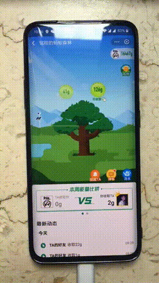
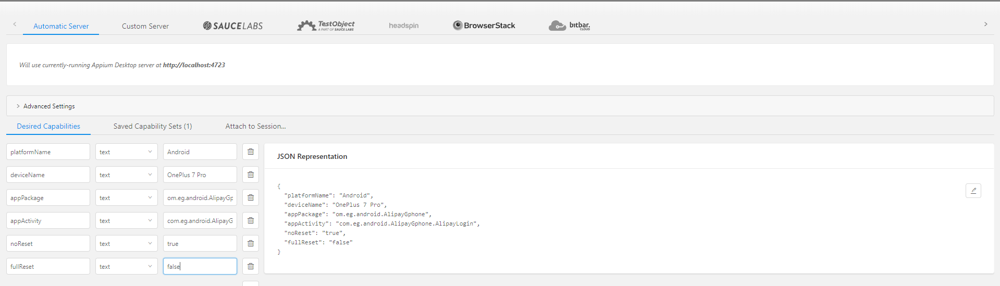

# 自动收集蚂蚁森林能量

> 该项目不断在优化，目前尚且存在一些细小问题，，项目需要提前安装Appium自动化测试工具，我会提供在下面的网盘中供下载。(仅Android版)

效果图

### 使用教程

* [下载](https://pan.baidu.com/s/1yUIXFCTBS8Vyx4YKmeo4FQ)Appium 1.8.2并安装,提取码:nytf

* 将手机调成**USB调试模式**

* 安装项目依赖 (selenium==3.141.0, urllib3==1.25.8)也可以pip install -r requirements.txt，解压根目录中Appium.rar解压之后放到项目文件夹**site-package**里面

* USB链接手机和电脑

* 点击Appium的start server 然后点击右上角的放大镜,进入如下页面，填入如下5行数据，将One Plus 7 Pro改成自己的手机型号( 前两行是支付宝的apk信息可通过adb查询到 ),同时修改sun_energy.py中**deviceName**为对应手机型号

  

* 点击start session,之后手机有一个确认提示点击确认即可，此时会在手机上安装Appium Setting 一个app

，此时可以在软件的左侧看到手机界面并进行控制。此时可以不管或者关掉控制手机的这个页面(主要作用是为了安装手机上面那个app)

* 最后运行sun_energy.py，运行时候**保持**手机和电脑的USB调试连接并且**关掉**支付宝软件。

  

### 尚存的问题

* 没有兼容并测试IOS设备
* 最下方的几个好友森林没法进不去
* 局限性有点大，需要用户因为不同手机型号自行调节边框位置
* 经测试每次运行需要先在appium里面连接一下手机才会出现密钥提示，项目才能正常运行

